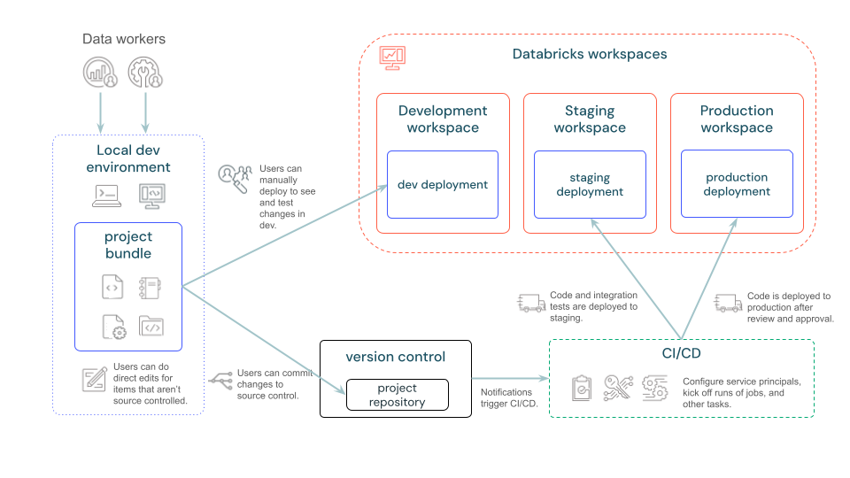
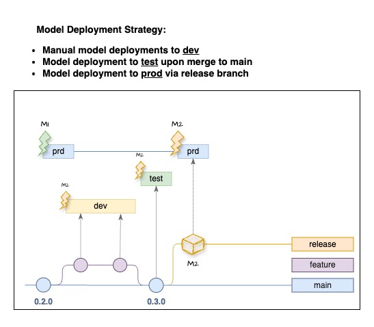

# Deployment

[Databricks Asset Bundles](https://docs.databricks.com/aws/en/dev-tools/bundles/) enable software engineering best practices for data and AI projects through source control, code review, testing, and CI/CD. Bundles define your entire project—structure, tests, and deployment—as source files, making collaboration seamless.

A bundle contains:

- Cloud infrastructure and workspace configurations
- Business logic (notebooks, Python files)
- Resource definitions (jobs, DLT pipelines, Model Serving endpoints, MLflow experiments)
- Unit and integration tests

The following diagram provides a high-level view of a development and CI/CD pipeline with bundles:

## Git Strategy

We follow an adaptation of the [**Microsoft Release Flow**](https://learn.microsoft.com/en-us/devops/develop/how-microsoft-develops-devops), a trunk-based branching strategy with three branch types:

| Branch | Purpose | Lifecycle |
|--------|---------|-----------|
| **main** | Integration branch, always buildable | Permanent |
| **feature** | Feature development and bug fixes | Short-lived (days) |
| **release** | Production releases | Permanent, read-only |

### Core Principles

- **Short-lived features**: Merge within days, not weeks
- **Main-first approach**: All changes flow through main
- **Unified workflow**: Hotfixes follow the same process as features
- **Semantic versioning**: Automated version bumps based on commit type

### Deployment Strategy

Our projects typically have two components with different deployment cadences:

- **Pipelines**: Data processing logic (infrequent updates)
- **Models**: Prediction services (regular updates)

Both follow the same Git workflow but use different production gates. This process ensures code quality through automated testing at each stage while maintaining control over production releases through manual gates or explicit release branches.

## Bundle Deployment

The bundle deployment process follows a progressive promotion strategy:

1. **Development** (`dev`)
   - Manual deployment from feature branches
   - Isolated testing environment
   - Command: `make deploy`

2. **Test** (`test`)
   - Automatic deployment on merge to main
   - Integration testing and validation
   - Pipeline: `cd.yml`

3. **Production** (`prod`)
   - **Pipelines**: Manual approval gate after test validation
   - **Models**: Release branch creation
   - Pipeline: `cd.yml`

## Model Deployment

Models require more sophisticated deployment strategies due to frequent updates and the need for A/B testing:

### Model Deployment Flow

In this example we are referring to the champion model by `M1` and the challenger model by `M2`.

1. **Development Phase**
   - Model challenger developed on feature branches
   - Manual deployments to `dev`, gradually promoting to `test`
   - Current champion model remains active in production

2. **Testing Phase**
   - Merge to `main` triggers deployment to `test`
   - **Champion/Challenger pattern**:
     - Model marked as champion processes all data
     - Model marked as challenger processes data subset
   - Performance comparison metrics evaluated

3. **Production Release**
   - Create release branch from `main` to trigger production deployment
   - **Role reversal**:
     - Model marked as challenger becomes champion, processes all data
     - Model marked as champion becomes challenger, processes data subset
   - Release branches remain read-only and permanent

## CI/CD

Our automated pipeline orchestrates testing, deployment, and versioning across all environments. Three main pipelines are defined in our workflow. A graphical overview of the full CI/CD process is shown at the bottom of the page.

### Continuous Integration (CI)

The `CI` pipeline ensures code quality and bundle functionality before merging.

**Trigger**: Pull request to any branch
**Pipeline**: `.github/workflows/ci.yml`

**Steps**:

1. Environment setup and dependency installation
2. Code quality checks (`ruff`, `mypy`, `pydoclint`)
3. Unit test execution with coverage reporting
4. Bundle validation and build verification

### Continuous Deployment (CD)

The `CD` pipeline automates Databricks Asset Bundle deployments across environments. The pipeline ensures consistent deployments while maintaining proper governance through environment-specific configurations and approval workflows.

**Trigger**: Merge to main branch
**Pipeline**: `.github/workflows/cd.yml`

**Flow**:

1. Automatic Databricks Asset Bundle deployment to test environment
2. Integration test execution
3. Manual approval gate (12-hour timeout)
4. Production deployment upon approval

### Semantic Release

The `semantic-release` pipeline automates versioning and changelog generation based on commit messages, ensuring consistent and predictable releases.

**Trigger**: Merge to main branch
**Pipeline**: `.github/workflows/semantic-release.yml`
**Configuration**: `release.config.mjs`

**Flow**:

The pipeline analyzes commit messages to determine the next version number:

| Commit Type                               | Description                                     | Example                     |
|-------------------------------------------|-------------------------------------------------|-----------------------------|
| `fix:`                                    | triggers a **patch** version update             | `1.0.0` --> `1.0.1`         |
| `feat:`                                   | triggers a **minor** version update             | `1.0.0` --> `1.1.0`         |
| `*!:`                                     | triggers a **major** version update             | `1.0.0` --> `2.0.0`         |

The appropriate version number is then automatically updated in the repository.

#### Automated `CHANGELOG` Generation

As part of the release process, we auto-generate a comprehensive `CHANGELOG`. The `CHANGELOG` is automatically updated with each release, capturing all notable changes, enhancements, bug fixes, and breaking changes based on the commit messages.

### Graphical Overview

